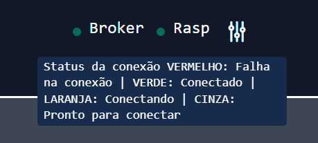
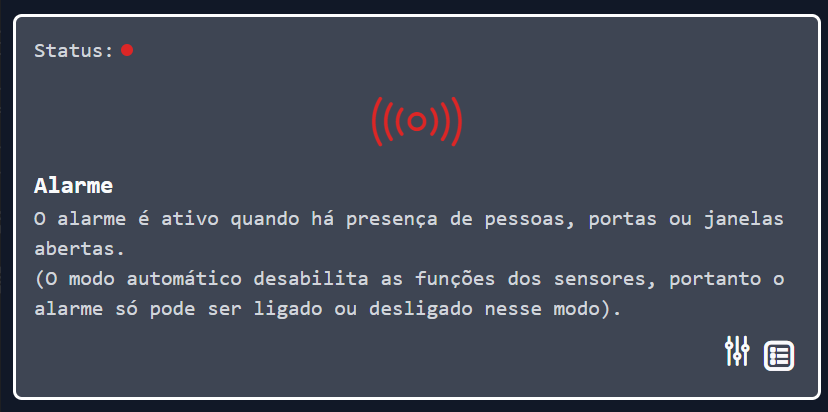
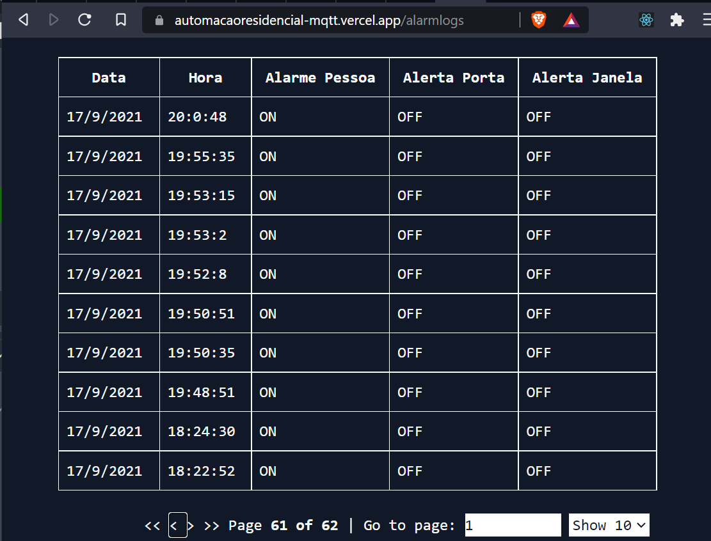

# Tutorial para a execução do projeto

## Frontend

O frontend da aplicação está hospedado na plataforma Vercel nesse <a href="https://automacaoresidencial-mqtt.vercel.app/"> Link </a>

## Manuseio da interface

### Conexão com o broker

Na parte superior da interface há um indicador de status da conexão do frontend com o broker e com a <em>Raspberry</em>. Também há um botão para a configuração do tempo de ping para a rasp.



### Modo automático

Logo em seguida há um card indicando o modo automático. Quando ativo, a aplicação passa a ser controlada pela as entradas da rasp, e quando inativo o usuário pode controlar os estados com botões na aplicação


### Alarme

Indica o status do alarme e emite um sinal vermelho quando há uma potencial invasão acontecendo. Quando normalizado o ícone e o status ficam verdes



## Ar condicionado

Indicação do status do ar condicionado e a sua temperatura


## Configuração dos dispositivos

Faixa de operação da temperatura quando está em modo automático ao clicar no ícone de configuração


A iluminação interna e o alarme são controlados por sensores


O jardim e a garagem podem ter seus horários modificados


## Logs do Alarme

Na rota `/alarmlogs` que pode ser acessada no card do alarm é possível ver o os logs do alarme



---

# Raspberry

## Instalação das biblitecas para execução do projeto no ambiente linux

Instalação da biblioteca PAHO MQTT
<a href="https://www.eclipse.org/paho/index.php?page=clients/c/index.php"> Veja mais aqui</a>

```shell
$ apt-get install libssl-dev doxygen
$ git clone https://github.com/eclipse/paho.mqtt.c.git
$ cd paho.mqtt.c
$ make
$ make html
$ make install
```

Instalação das bibliotecas para a conexão com o mongodb
<a href="http://mongoc.org/libmongoc/1.19.0/installing.html">Veja mais aqui</a>

```shell
$ apt-get install libmongoc-1.0-0
$ apt-get install libbson-1.0-0
$ apt-get install cmake libssl-dev libsasl2-dev
$ wget https://github.com/mongodb/mongo-c-driver/releases/download/1.19.0/mongo-c-driver-1.19.0.tar.gz
$ tar xzf mongo-c-driver-1.19.0.tar.gz
$ cd mongo-c-driver-1.19.0
$ mkdir cmake-build
$ cd cmake-build
$ cmake -DENABLE_AUTOMATIC_INIT_AND_CLEANUP=OFF ..
$ cmake --build .
$ sudo cmake --build . --target install
```

## Biblioteca wiringpi para utilização dos pinos da raspberry

<a href="http://wiringpi.com/download-and-install/">Veja mais aqui</a>

```shell
$ sudo apt-get install wiringpi
```

---

## Obtendo o projeto da raspberry

```shell
$ git clone https://github.com/viubis/PBL2
$ cd PBL2
```

## Executando o projeto da raspberry

Devido a problemas que tivemos ao fazer o link da biblioteca do banco na raspberrypi, disponibilizamos o código com e sem a utilização do banco

### Sem utilizar o banco

```
$ gcc app.c -o app -lpaho-mqtt3cs  && ./app

```

### Utilizando o banco

```
$ gcc appmongo.c -ljson-c -o appmongo -lpaho-mqtt3cs -Wall -I/usr/include/libbson-1.0 -I/usr/include/libmongoc-1.0 -lmongoc-1.0 -lbson-1.0 && ./appmongo
```

### Logs da aplicação

Durante a aplicação o sistema salva todas as mudanças de estado dos dispositivos e do sistema no arquivo `logs.csv`, que vai ser salvo da raiz da aplicação. Um exemplo desses logs é o arquivo `example.logs.csv`
